# 构建主机端开发环境（下）

## 一、实验目的
1. 学会下载安装Linux及相关工具到目标机或目标机仿真环境。
2. 学会使用交叉编译器编译应用程序，并能够将可执行程序下载到目标机运行。
3. 学会使用交叉调试工具gdb-gdbserver调试应用程序。

## 二、实验内容
1. 下载安装Linux系统到树莓派开发板，并建立*host-target*连接。
2. 下载qemu虚拟机并安装树莓派系统。
3. 构建并测试开发板交叉编译器。
4. 建立gdb-gdbserver交叉调试环境并能够调试应用程序。

## 三、实验过程与结果
### 1、安装Linux系统到树莓派开发板并建立*host-target*连接
* 下载树莓派官方镜像文件**2020-02-13-raspbian-buster-lite**
* 格式化内存卡，将镜像文件烧录到内存卡中。
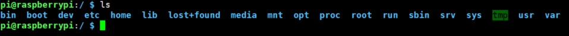
* 新版本树莓派系统默认关闭ssh服务，使用`sudo rasip-config`进入配置界面打开ssh服务。
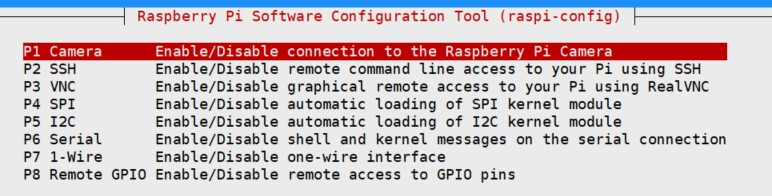
* 通过`ifconfig`命令获取树莓派ip地址，即可实现ssh远程访问树莓派系统。
### 2、下载qemu虚拟机并安装树莓派系统
### 3、构建并测试开发板交叉编译环境
* 下载交叉编译工具链到本地虚拟机中
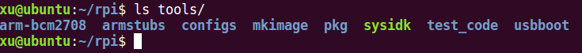
* 修改bashrc文件，添加环境变量
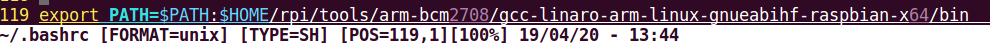
* 使用命令`arm-linux-gnueabihf-gcc hello.c -o hello`产生可执行文件hello
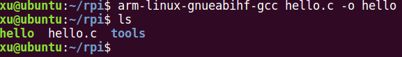
* 使用软件filezilla将可执行文件hello上传到树莓派中
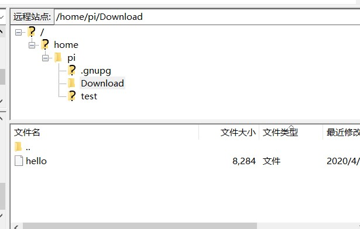
* 在树莓派上执行程序hello，得到正确输出结果
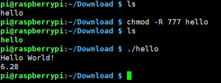
### 4、建立gdb-gdbserver交叉调试环境并能够调试应用程序。
* 下载gdb-6.6到本地虚拟机，通过对应指令安装到/usr/local目录下
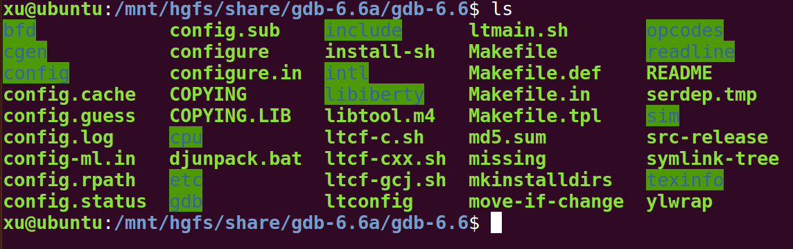
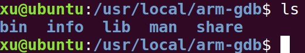
* 通过`./configure --target=arm-linux --host=arm-linux-gnueabihf`和`make`指令生成gdbserver,并将对应的可执行文件和gdbserver一起上传到树莓派系统中
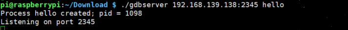
* 在host端打开gdb，进行调试操作


## 四、实验总结
* 实验中遇到的问题
    1. 在安装交叉编译工具完成后，运行`arm-linux-gnueabinhf-gcc -v`报错
    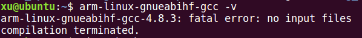
    使用`apt-get install gcc-arm-linux-gnueabihf`命令安装`gcc-arm-linux-gnueabihf`后解决。
    2. 在安装gdb/gdbserver联合调试工具时，出现了make出错的情况
    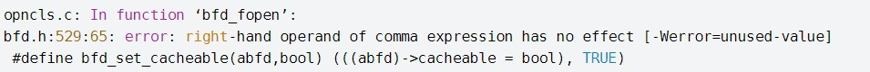
    该错误可以通过在配置命令中加入`--disable-werror`来解决，使用`sudo apt-get install libncurses5-dev`命令后，gdb安装成功

## 五、实验源码
Hello.c
```
#include<stdio.h> 
int main(void)
 {
     float pi = 3.14;
     printf("Hello World!\n");
     printf("%.2f\n", 2 * pi);
}
```            