# 构建目标系统

## 一、实验目的
1. 掌握裁剪Linux内核的方法，理解内核选项的意义。
2. 熟悉编译内核并加载内核到目标系统的方法与过程。
3. 了解模块与内核的关系，掌握内核模块配置编译、安装与卸载流程，为进一步编程，如驱动编程打下基础。
4. 掌握创建、安装(卸载)并使用文件系统的方法。

## 二、实验内容
1. 使用默认配置重新编译已安装到开发板的内核，并将新内核替换现有内核，验证是否通过。
2. 重新配置配置Linux内核，构建一个嵌入式的linux内核，要求针对不少与10个kernel feature重新配置，保留必要的模块安装，取消剩余的。
3. 编译并安装重新配置后的内核、模块和dtbs设备树到开发板运行测试，至少测试两个模块的加载和卸载。
4. 构建并安装至少一款不同于根文件系统、用于应用开发的其它文件系统。

## 三、实验过程与结果
### 1、重新编译已安装到开发板的内核
* 下载树莓派官内核源码
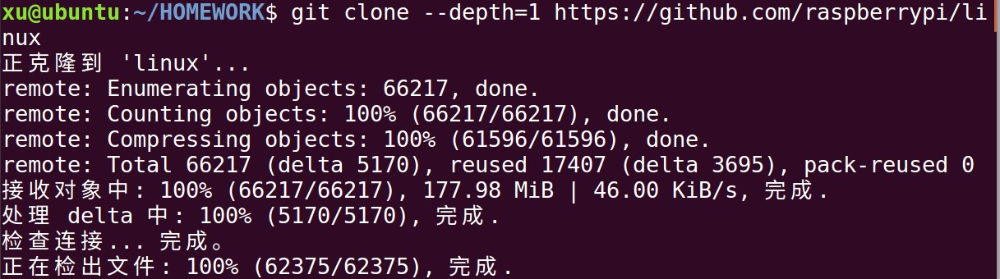

* 使用交叉编译工具对内核进行编译。
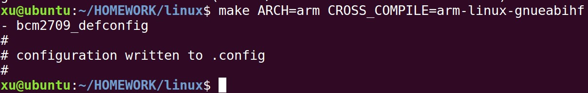

* 内核编译完成。
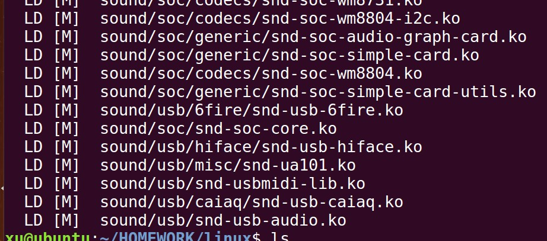

* 产生的zImage文件
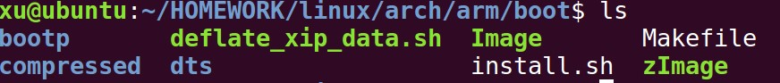

* 替换现有内核后，成功启动，启动界面如下
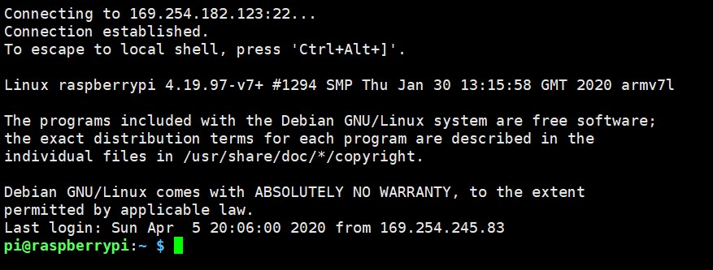

### 2、重新配置Linux内核
* 通过`make menuconfig`命令

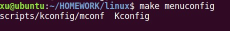

* 在图形界面中进行勾选需要的功能

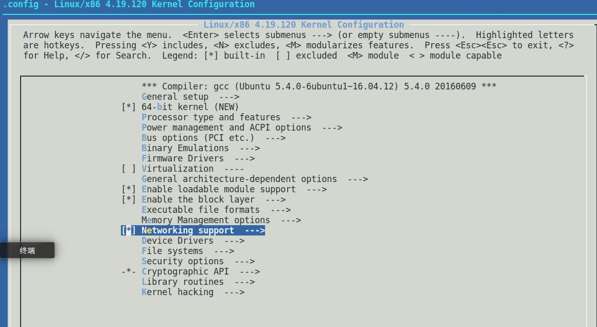

勾选后进行编译，重新生成裁剪后的内核系统

### 3、测试模块的加载和卸载
* 使用命令查看已装载的模块数和总模块数

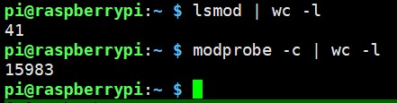

* 原始模块装载情况

* 装载模块ath9k，装载成功后使用`lsmod`查看模块装载情况

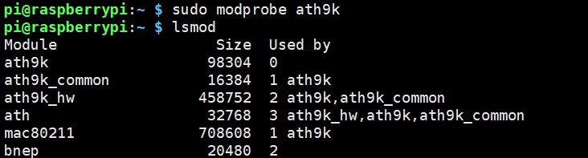

* 卸载模块ath9k，卸载成功后使用`lsmod`查看模块卸载情况

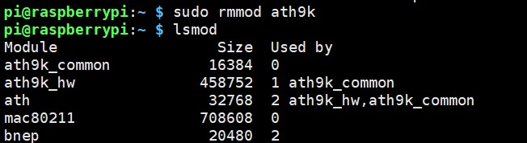

可见还有at9k_common等模块残留。
* 继续卸载模块ath9k_common，卸载成功后使用`lsmod`查看模块卸载情况

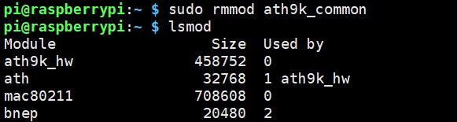

## 四、实验总结
* 实验中遇到的问题
    1. 在进行内核编译时，运行`make ARCH=arm CROSS_COMPILE=arm-linux-gnueablihf- bcm2709_defconfig`报错
    
    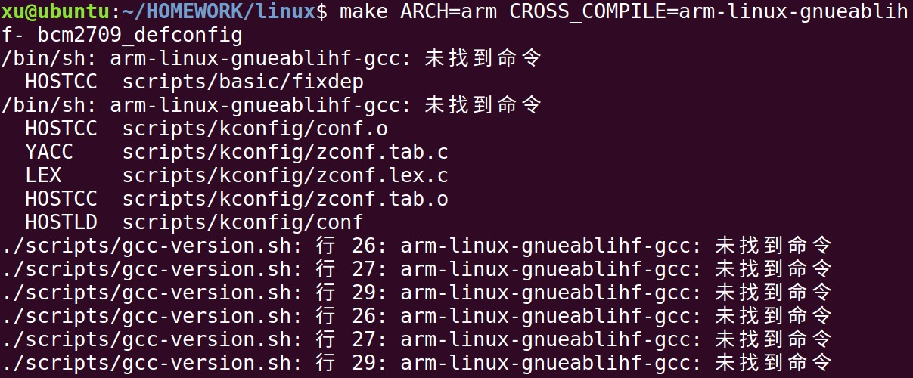

    检查发现是交叉编译工具选择错误，选择正确的交叉编译工具后问题解决。
    2. 在生成zImage时报错
    
    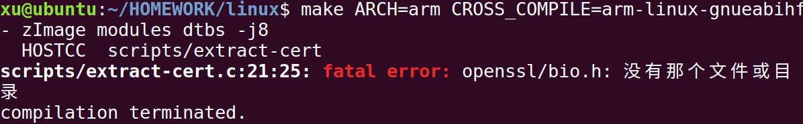

    该错误是因为Ubuntu中未安装openssl，通过命令`sudo apt install libssl-dev`安装后解决该问题。
    3. 在运行`make menuconfig`时报错
    
     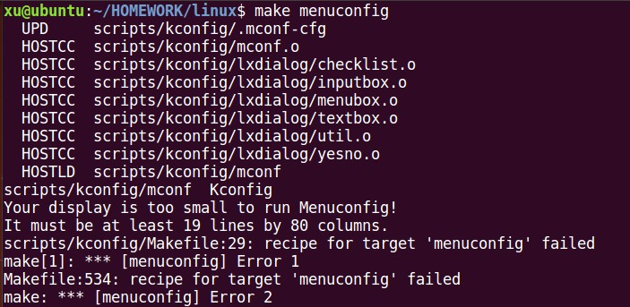

     该错误原因时因为终端字体设置太大，将字体调小后即可解决该问题。

