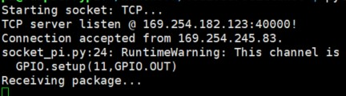

# 一、实验目的
**能够综合应用课程所学的技术与工具，包括：**
* Socket通信
* 多进程、多线程编程
* 交叉调试目标端程序
* 磁盘分区与文件系统创建
* 模块与驱动编程

# 二、实验内容
1. 将树莓派设为智能监控系统的Linux服务器，可以用来采集并识别人脸，识别人脸后亮起信号灯发出警报，并将人脸数据拍照留存。
2. 要求创建2个以上的scull设备，设备驱动可选择从内核源码树外(Kbuild)编译安装，或加入到内核源码树内。驱动函数要求包括： open, release, read, write, llseek, ioctl。
3. 实验中的环境数据存储在特定文件系统中。该文件系统要求具备属性：在线写入、持久性、断电可靠性。
4. PC机、移动设备或另外一个树莓派用作远程客户端，随时请求获取环境数据，客户端和服务器之间采用Socket通信。
5. APP编译采用交叉编译，用gdb-gdbserver交叉调试APP。


# 三、实验过程与结果

## 系统工作流程图


## OpenCV安装
**1. 升级系统软件包**
```
sudo apt-get update
sudo apt-get upgrade
```
**2. 安装开发工具**
```
sudo apt-get install build-essential cmake git pkg-config
```
**3. 安装图像I/O包**
```
sudo apt-get install libjpeg-dev libtiff5-dev libjasper-dev libpng12-dev
```
**4. 从GitHub上下载OpenCV代码**
```
git clone https://github.com/Itseez/opencv_contrib.git
```
**5. build**
```
cd ~/opencv
mkdir build
cd build
cmake -D CMAKE_BUILD_TYPE=RELEASE -D CMAKE_INSTALL_PREFIX=/usr/local -D INSTALL_C_EXAMPLES=OFF -D INSTALL_PYTHON_EXAMPLES=ON -D OPENCV_EXTRA_MODULES_PATH=~/opencv_contrib/modules -D BUILD_EXAMPLES=ON ..
```
**6. make**
```
make -j4
sudo make install
sudo ldconfig
```
**7. 安装成功后效果**


## 摄像头驱动编写
**1. 输入`sudo raspi-config`选择Interfacing Option，试能Camera**


## GPIO控制LED小灯


LED小灯的正负极分别接11号端口和9号端口，其中9号端口接地，编程控制11号端口输出高低电平实现LED小灯的开关。


## scull设备安装及驱动编写

**1、 scull编译**
（1）安装必要软件包

```
sudo apt install build-essential bison flex libssl-dev libelf-dev
```


（2）下载内核源码，构建源码树

```
1） sudo apt install linux-source-4.15.0 -y
```


```
2） cd /usr/src/linux-source-4.15.0/

sudo tar xf linux-source-4.15.0.tar.bz2
 
cd linux-source-4.15.0/
 
sudo make oldconfig
```


```
3） sudo make prepare
```


```
4） sudo make scripts
```


（3）make


**2、 加载和卸载驱动模块scull**
（1）加载驱动模块
```
 sudo insmod scull.ko
```


也可以在/proc/devices查看字符设备注册是否注册成功

```
 cat /proc/devices
```


（2）卸载驱动模块
```
 sudo rmmod scull.ko
```


**3、创建设备文件，并测试字符驱动**

（1）在加载驱动模块后，需要创建一个设备文件，以便对这个设备文件进行操作，主设备号为243，次设备号为0。

```
 mknod /dev/scull0 c 243 0
```


（2）测试字符驱动

向设备文件写入1314，并查看设备文件内容。

```
 echo 1314 > /dev/scull0 
 cat /dev/scull0 
```


**4、创建3个scull设备**

（1）修改Makefile文件，创建scull1、scull2、scull3

```
obj-m := scull1.o scull2.o scull3.o
KDIR = /root/linux-2.6.36.4/
PWD:=$(shell pwd)
INSTALLDIR=$(PWD)
modules:
	$(MAKE) -C /lib/modules/`uname -r`/build M=`pwd` modules
clean:
	rm -f *.mod.c *.mod.o *.ko *.o *.tmp_versions
.PHONY:modules clean
```

（2）make


（3）加载驱动模块

```
 sudo insmod scull1.ko
 sudo insmod scull2.ko
 sudo insmod scull3.ko
```


（4）卸载驱动模块

```
 sudo rmmod scull1.ko
 sudo rmmod scull2.ko
 sudo rmmod scull3.ko
```


## 文件系统创建
**1、 构建分区**
```
Linux fdisk命令

语法：fdisk [必要参数][选择参数]
必要参数：
-l 列出素所有分区表
-u 与"-l"搭配使用，显示分区数目 
选择参数：
-s<分区编号> 指定分区
-v 版本信息

菜单操作说明
m ：显示菜单和帮助信息
a ：活动分区标记/引导分区
d ：删除分区
l ：显示分区类型
n ：新建分区
p ：显示分区信息
q ：退出不保存
t ：设置分区号
v ：进行分区检查
w ：保存修改
x ：扩展应用，高级功能
```
（1）用fdisk指令在/dev/sda上构建新的分区
```
 sudo fdisk /dev/sda
```


（2）显示分区信息


（3）新建分区并保存修改


**2、用mkfs指令将分区格式化为所需要的格式** 
```
 sudo mkfs -t ext3 /dev/sda3
```


**3、用mount指令将格式化好的分区挂载到树莓派上某挂载点**
```
 sudo mount –t ext3 /dev/sda3 /mnt/ext3fs
```

## socket通信
**1. 树莓派端socket通信连接**


**2. PC端运行socket程序**


**3. 成功建立通信**
PC端接受到树莓派端发来的信息**welcome to RPi TCP server!**通过输入1和0来控制树莓派端的LED小灯的开或关。




# 四、实验总结
**产品最终效果**

**1. 人脸识别**


成功识别到人脸时，小灯亮起


没有识别到人脸时，小灯熄灭


